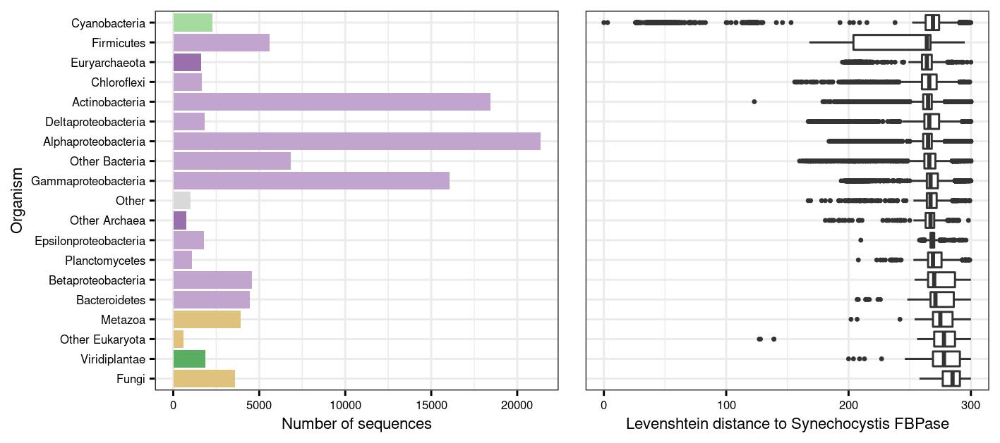
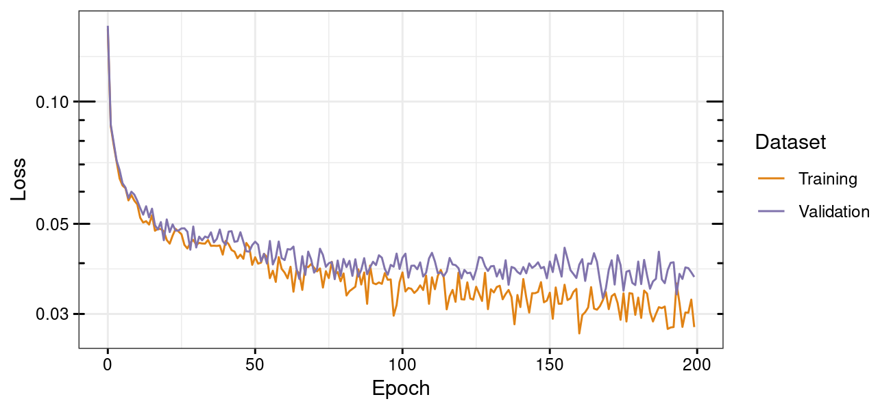
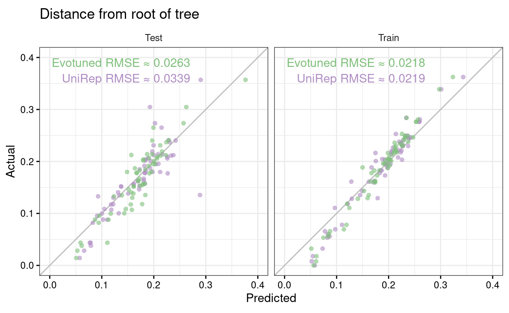
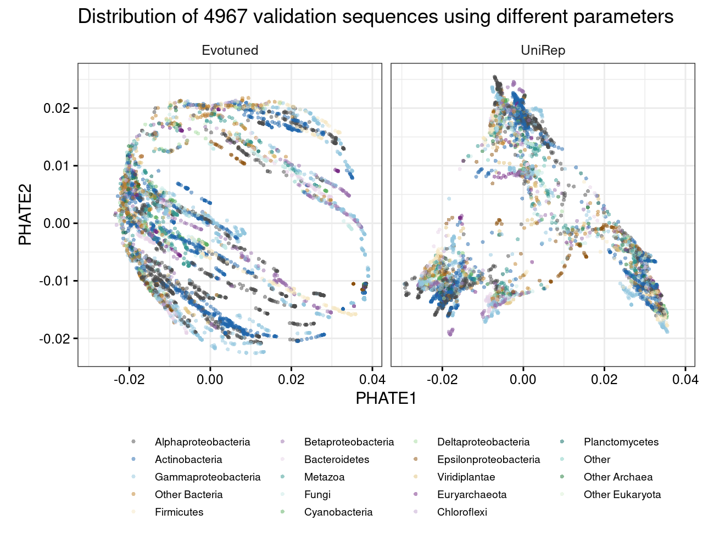
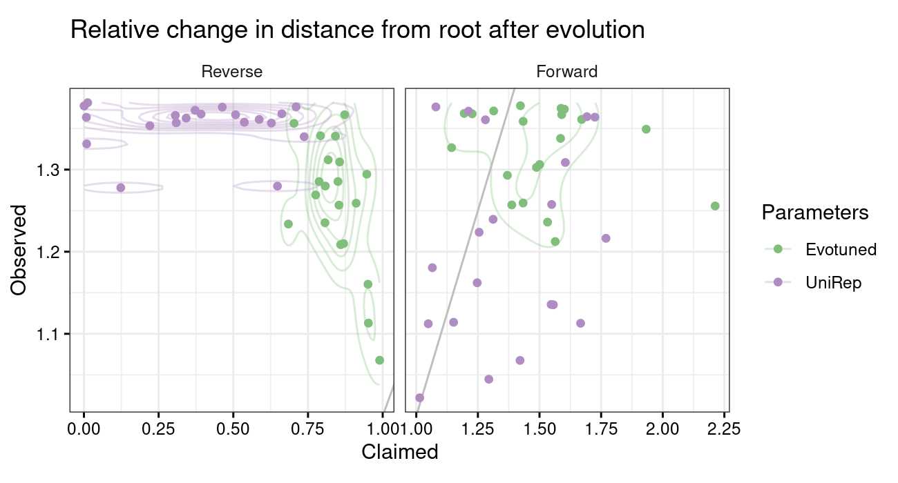
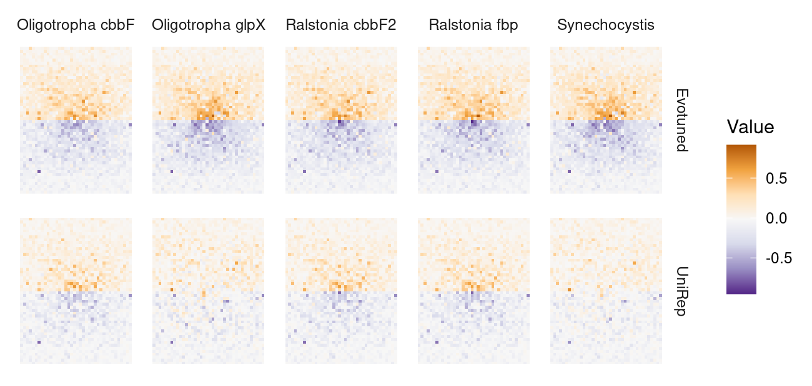

# FBPase UniRep Enzyme Engineering

Engineering of the Calvin cycle enzyme fructose-1,6-bisphosphatase/sedoheptulose-1,7-bisphosphatase (FBPase/SBPase) through [UniRep](https://github.com/churchlab/UniRep) machine learning and _in silico_ evolution.

### Contents

1. [Usage](#usage)
2. [System requirements](#requirements)
3. [Installation](#installation)
4. [Exploring evotuning of FBPase](#exploring)
5. [Author](#author)

<a name="usage"></a>
## Usage

This guide describes how to get training data, carry out evotuning, fit a top model, and perform _in silico_ evolution using FUREE.

An already evotuned model for FBPase is provided (`data/parameters/iter_final/`), so if you wish you may skip the first three steps and go directly to [Fitting a top model](#topmodel).

### 1. Obtain target sequences

The evotuning training data are UniProt sequences extracted through iterative JackHMMer searches against a small, but diverse, set of target sequences related to the protein to be evolved _in silico_. When preparing the training data in the next step, the input is a FASTA file with such target sequences.

FUREE offers a programmatic approach to obtaining target sequence suggestions in the form of UniProt sequences representing KEGG orthologs (KOs). The program takes a comma-separated list of KOs (option `-k`) and/or a file with one KO per line (option `-i`) and saves the corresponding UniProt sequences to a FASTA file:

```
source/uniprot_sequences_from_KO.sh \
-i data/FBPase_KOs.txt \
-o intermediate/FBPase_KOs.fasta
```

Since we want to have a manageable number of sequences as targets for the JackHMMer search, we need to reduce them to cluster representatives based on 40% sequence identity:

```
cd-hit -c 0.4 -n 2 \
-i intermediate/FBPase_KOs.fasta \
-o intermediate/FBPase_KOs.cdhit.fasta
```

Finally, we add other target sequences that we think might be particularly important, such as FBPases from _Synechocystis_, _Oligotropha_, and _Ralstonia_:

```
cat \
intermediate/FBPase_KOs.cdhit.fasta \
data/Oligotropha_OM5_c20090_FBPase.fasta \
data/Oligotropha_OM5_pHCG300410_FBPase.fasta \
data/Ralstonia_H16_A0999_FBPase.fasta \
data/Ralstonia_H16_B1390_FBPase.fasta \
data/Syn6803_P73922_FBPase.fasta \
> intermediate/FBPase_targets.fasta
```

We are now ready to use the target sequences to prepare the evotuning training data.

### 2. Prepare training data

The target sequences are used for JackHMMer searches against the UniProt sequence database and subsequently filtered (see table below for more details). We run a preparation script with the target sequences, the _in silico_ evolution target sequence, and direct the output to a directory of choice:

```
source/preparation.sh \
intermediate/FBPase_targets.fasta \
data/Syn6803_P73922_FBPase.fasta \
results/FBPase
```

Output from the preparation steps are saved into the log file `results/FBPase/preparation.log`.

Preparation of the training sequences involves the following:

| # | Description |
| --- | --- |
| 1 | JackHMMer at default settings and a maximum of five rounds is used to find candidate UniProt sequences for evotuning. Require full sequence E-value < 0.01 and best 1-domain E-value < 0.03. |
| 2 | Use CD-HIT to make identified sequences unique. |
| 3 | Require that sequences consist of only standard amino acids. |
| 4 | Require that sequences show length within two standard deviations from the mean, and then Levenshtein distance to target ≤ 300. |
| 5 | Assess taxonomic distribution of training data (`results/FBPase/results/taxonomic_distribution_of_train.png`). |
| 6 | Save training sequences to file with one sequence per line. |

The final unique and filtered training sequences are stored in this file:

```
results/FBPase/results/train.txt
```

Next, we supply the prepared training sequences to the evotuning script to adapt the UniRep model to our particular sequence context of interest.

### 3. Evotuning

The UniRep model weights, or parameters, must be re-trained, or evotuned, to the local evolutionary context of our _in silico_ evolution target sequence. We supply our meticulously prepared training sequences to the evotuning script as such:

```
source/evotune.py \
  --epochs 100 --validation 0.05 \
  --step 1e-5 --batch 32 --dumps 1 \
  results/FBPase/results/train.txt \
  results/FBPase/evotuned
```

The validation sequences are saved in
`results/FBPase/evotuned/validation_sequences.txt`. A log is saved to `results/FBPase/evotuned/evotuning.log`, with training and validation loss neatly formatted in `results/FBPase/evotuned/evotuning.tab`. The losses are plotted in `results/FBPase/evotuned/evotuning.png`.

Most importantly, the new model parameters are saved in this Pickle:

```
results/FBPase/evotuned/iter_final/model_weights.pkl
```

With a finished set of evotuned UniRep parameters, we can now move on to fitting a top model, which will allow us to perform the _in silico_ evolution.

<a name="topmodel"></a>
### 4. Fitting a top model

To fit a top model, it is necessary to provide sequences and associated values that are to be improved through directed evolution. Sequences and values should be saved in a tab-delimited format as in _e.g._ `data/dummy.train.tab` (here we look only at the last 60 characters of each line to save space):

```
head -5 data/dummy.train.tab | rev | cut -c 1-60 | rev
```

```
CGITPGTLMQGVQFFHNGARTQSLVISSQSRTARFVDTIHMFDKLEYVQLR	0.161198
CGITPGTLMEGVRFFHGGARTQSLVISSQSKTARFVDTVHMTDQPKTIQLK	0.078044
CGITPGTLMEGVRFFHGGARTQSLVISSQSKTARFVDTIHMFDQPKSIQLR	0.017744
CGITPGSLMEGVRFFGGGARTQSLVISNQSQTARFVDTIHLFDNVKSLQLR	0.173089
CGITPGTLMEGVRFFKGGARTQSLVISSQSQTARFVDTIHMFEEPKVLQLR	0.246331
```

To fit the Ridge Regression Sparse Refit top model using evotuned FBPase-specific UniRep parameters for the underlying representations, use the following command:

```
source/train_top_model.py \
-p results/FBPase/evotuned/iter_final \
data/dummy.train.tab \
intermediate/dummy.top_model.pkl
```

_NOTE: Using too many input sequences may exhaust the available memory!_

For additional options, refer to the help:

```
source/train_top_model.py --help
```

### 5. Making predictions with the top model

Predictions can be made on sequences in a file with one sequence per line (`data/Syn6803_P73922_FBPase.txt` has only one line, but more are allowed):

```
cat data/Syn6803_P73922_FBPase.txt | cut -c 1-80
```

```
MDSTLGLEIIEVVEQAAIASAKWMGKGEKNTADQVAVEAMRERMNKIHMRGRIVIGEGERDDAPMLYIGEEVGICTREDA
```

To make predictions using an already fitted top model, use the following command:

```
source/top_model_prediction.py \
-p results/FBPase/evotuned/iter_final \
data/Syn6803_P73922_FBPase.txt \
intermediate/dummy.top_model.pkl \
results/FBPase/Syn6803_P73922_FBPase.prediction.tab
```

_NOTE: Using too many input sequences may exhaust the available memory!_

The prediction for `data/Syn6803_P73922_FBPase.txt` is in `results/FBPase/Syn6803_P73922_FBPase.prediction.tab` and should be `0.1848269612693981`.

For additional options, refer to the help:

```
source/top_model_prediction.py --help
```

### 6. Performing _in silico_ evolution

The _in silico_ evolution is carried out using a set of evotuned parameters, a top model, and one starting sequence:

```
source/in_silico_evolution.py \
-s 50 -t 15 \
-p results/FBPase/evotuned/iter_final \
data/Syn6803_P73922_FBPase.txt \
intermediate/dummy.top_model.pkl \
results/FBPase/Syn6803_P73922_FBPase.evolved.tab
```

_NOTE: Using too many steps may exhaust the available memory!_

The output `results/FBPase/Syn6803_P73922_FBPase.evolved.tab` contains evolved sequences (column `sequences`), predicted values for each sequence (`scores`), status of acceptance for the next iteration in the evolution algorithm (`accept`), and the step (`step`).

For additional options, refer to the help:

```
source/in_silico_evolution.py --help
```

<a name="requirements"></a>
## System requirements

Evotuning was performed on a GCP VM with two vCPUs, 13 GB RAM, and one NVIDIA Tesla T4 GPU with 16 GB VRAM. Other tasks were performed on Linux systems with 16 cores and 128 GB RAM (Ubuntu 18.04.5 LTS) and 12 cores, 32 GB RAM, and an NVIDIA RTX 2070 SUPER GPU with 8 GB VRAM (Ubuntu 20.04.1 LTS).

| Software | Version | Tested version | Libraries |
| -------- | ------- | -------------- | --------- |
| Linux OS | | Ubuntu 18.04.5 LTS and 20.04.1 LTS | |
| Bash | 4.0 | 4.4.20, 5.0.17 | |
| Python | 3.7 | 3.7.6, 3.8.3 | BioPython, Levenshtein, jax, jax-unirep, numpy, pandas, scipy, sklearn |
| R | 3.6.3 | 3.6.3 | tidyverse, phateR, phytools, ggtree, egg |
| GNU parallel | 20161222 | 20161222 | |
| hmmer | 3.1b2 | 3.1b2 | |
| fasttreeMP | 2.1.11 | 2.1.11 | |

<a name="installation"></a>
## Installation

### This repository

Download the FUREE repository from GitHub and enter the directory:
```
git clone https://github.com/Asplund-Samuelsson/furee.git

cd furee
```

### JAX-UniRep

The analysis uses the user-friendly JAX implementation of UniRep named [jax-unirep](https://github.com/ElArkk/jax-unirep). It may be installed from PyPI as described below (see the jax-unirep GitHub repository for more details):

```
pip install jax-unirep
```

To enable CUDA GPU support, you may need to install the correct JAX packages; see [instructions in the JAX repository](https://github.com/google/jax#pip-installation).

### UniProt database (optional)

Training sequences will be extracted from the UniProt database. Run these commands to download the necessary FASTA files for SwissProt and TrEMBL, constituting UniProt (may take several hours):

```
cd data/uniprot

wget ftp://ftp.uniprot.org/pub/databases/uniprot/current_release/knowledgebase/complete/uniprot_sprot.fasta.gz

wget ftp://ftp.uniprot.org/pub/databases/uniprot/current_release/knowledgebase/complete/uniprot_trembl.fasta.gz

zcat uniprot_sprot.fasta.gz uniprot_trembl.fasta.gz > uniprot.fasta

rm uniprot_sprot.fasta.gz uniprot_trembl.fasta.gz # Optional cleanup

cd ../..
```

### NCBI taxonomy database (optional)

This analysis uses the NCBI taxonomy database to assign taxonomic classifications to UniProt sequences. Run these commands to download the necessary `names.dmp` and `nodes.dmp` files:

```
cd data/ncbi/taxonomy

wget https://ftp.ncbi.nlm.nih.gov/pub/taxonomy/taxdump.tar.gz

tar -zxvf taxdump.tar.gz names.dmp nodes.dmp

rm taxdump.tar.gz # Optional cleanup

cd ../../..
```

<a name="exploring"></a>
## Exploring evotuning of FBPase

Evotuning using FBPase sequences was performed and evaluated in order to get acquainted with the JAX-UniRep framework and develop the tools in this repository. The steps to acquire example FBPase sequences and then evotune the UniRep model are described in `source/fbpase_evotuning_example.sh`.

### Jackhmmer reference sequences

The Jackhmmer search for training sequences in UniProt begins with a set of known target sequence relatives. We obtain this set from KEGG orthologs K01086 and K11532 by following the instructions in this bash script:

```
source/get_FBPase_sequences.sh
```

...yielding this FASTA file with initial reference protein sequences:

```
data/kegg_uniprot.FBPase.fasta
```

### Acquisition of example sequences

Jackhmmer was used to find 99,327 example sequences in the UniProt database. These sequences were mostly bacterial.



### Training

The evotuning held out 4,967 sequences for validation and optimized parameters using the remaining 94,360 sequences. The losses reported by the JAX-UniRep _fit_ function for the training and validation sequences were plotted for 100 epochs of training with learning rate 1e-5 and batch size 128. The final iteration weights were accepted for future use since overfitting was not evident.



### Evaluation of a top model

#### Ancestral sequences and failed dummy data

A set of dummy stability (_T<sub>m</sub>_) values were generated to facilitate development of the top model and _in silico_ evolution scripts. First, a phylogenetic tree was constructed based on 63 UniProt FBPase sequences (>85% identity) including the sequence in _Synechocystis_ sp. PCC 6803. Ancestral sequence reconstruction was performed using the [FireProt-ASR server](http://loschmidt.chemi.muni.cz/fireprotasr/). Changes in _T<sub>m</sub>_ were sampled going from the root sequence (_T<sub>m</sub>_ = 80°C) assuming decreasing stability with a target of _T<sub>m</sub>_ = 55°C at the furthest tip of the tree. The process was carried out as described in these scripts:

```
source/generate_dummy_Tm_data.sh
source/generate_dummy_ancestral_Tm.R
```

...finally yielding this table of 125 sequence-to-dummy-stability associations:

```
data/dummy.sequence_Tm.tab
```

...which represents typical input for training a top model.

The dummy _T<sub>m</sub>_ values are visualized in `data/dummy_ancestral_Tm_on_tree.pdf`. Unfortunately, it turned out that the dummy stability values generated were purely noise and could not be used for development of the top model.

#### Better luck with tree height values

Instead of the failed stability values, the tree height (distance from the root) of each node (sequence) was used as detailed in these scripts:

```
source/evaluate_top_model.sh
source/evaluate_top_model.R
```

...that generated and evaluated the following height data:

```
data/dummy.train.tab
data/dummy.test.tab
```

#### Top model performance

Splitting the set of ancestral and contemporary sequences into 63 training sequences and 62 testing sequences allowed development of a Ridge regression sparse refit (SR) top model used to predict height in the phylogenetic tree. The top model showed test RMSE ≈ 0.0339 using original UniRep mLSTM parameters and test RMSE ≈ 0.0263 using evotuned parameters.



### Evaluation of sequence landscape

The validation sequences were transformed into representations using the original UniRep parameters as well as the freshly evotuned FBPase-specific parameters. The representations were in turn used to visualize the sequence landscape using [PHATE](https://github.com/KrishnaswamyLab/PHATE). The evotuned landscape was distinct from the original UniRep landscape; Possibly smoother and hopefully more information rich.



### Evaluation of _in silico_ evolution potential

The _Synechocystis_ sp. PCC 6803 FBPase sequence was subjected to _in silico_ evolution (trust radius 15, 50 steps) guided by the evotuned mLSTM and the top model fitted on tree height values. Subsequently, the 80 best evolved sequences were separately aligned with the original 63 example sequences from "Evaluation of a top model". Trees were then constructed to estimate the change in tree height of the evolved sequences. This showed that the evotuned parameters lead to stronger evolution in the forward direction, and rightfully made more conservative claims for evolution in the reverse direction (which appeared to be impossible).



### Visualization of example FBPase representations

Representations were obtained for five FBPase sequences using original and evotuned UniRep parameters. The sequences are _Oligotropha carboxidovorans_ OM5 [_cbbF_](https://www.kegg.jp/dbget-bin/www_bget?ocg:OCA5_pHCG300410) and [_glpX_](https://www.kegg.jp/dbget-bin/www_bget?ocg:OCA5_c20090), _Ralstonia eutropha_ H16 [_cbbF2_](https://www.kegg.jp/dbget-bin/www_bget?reh:H16_B1390) and [_fbp_](https://www.kegg.jp/dbget-bin/www_bget?reh:H16_A0999), and _Synechocystis_ sp. PCC 6803 FBPase. The 1,900 representation values were ordered and plotted so that large standard deviations were located to the center of one 38 by 50 pixel image per sequence.



<a name="author"></a>
## Author
Johannes Asplund-Samuelsson, KTH (johannes.asplund.samuelsson@scilifelab.se)
