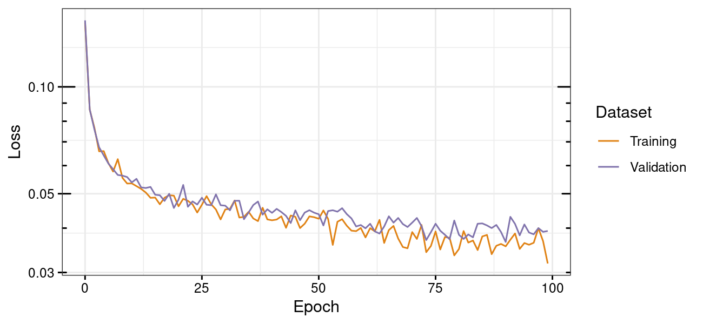

# FBPase UniRep Enzyme Engineering

Engineering of the Calvin cycle enzyme fructose-1,6-bisphosphatase/sedoheptulose-1,7-bisphosphatase (FBPase/SBPase) through [UniRep](https://github.com/churchlab/UniRep) machine learning and _in silico_ evolution.

## Quickstart

Instructions on how to fit a top model and perform _in silico_ evolution should go here.

## System requirements

Linux operating system (Tested on Ubuntu 18.04.5 LTS and 20.04.1 LTS)

bash 4.0 (Tested with 4.4.20(1)-release and 5.0.17(1)-release)

Python 3.7 (Tested with 3.7.6 and 3.8.3)

R ≥ 3.6.3 (Tested with 3.6.3)

GNU parallel 20161222 (Tested with 20161222)

seqmagick 0.6.2 (Tested with 0.6.2)

hmmer 3.1b2 (Tested with 3.1b2)

Python libraries: ...

R libraries: ...

## Installation

### This repository

Download the FUREE repository from GitHub and enter the directory:
```
git clone https://github.com/Asplund-Samuelsson/furee.git

cd furee
```

### JAX-UniRep

The analysis uses the user-friendly JAX implementation of UniRep named [jax-unirep](https://github.com/ElArkk/jax-unirep). It may be installed from PyPI as described below (see the jax-unirep GitHub repository for more details):

```
pip install jax-unirep
```

To enable CUDA GPU support, you may need to install the correct JAX packages; see [instructions in the JAX repository](https://github.com/google/jax#pip-installation).

### UniProt database (optional)

Training sequences will be extracted from the UniProt database. Run these commands to download the necessary FASTA files for SwissProt and TrEMBL, constituting UniProt (may take several hours):

```
cd data/uniprot

wget ftp://ftp.uniprot.org/pub/databases/uniprot/current_release/knowledgebase/complete/uniprot_sprot.fasta.gz

wget ftp://ftp.uniprot.org/pub/databases/uniprot/current_release/knowledgebase/complete/uniprot_trembl.fasta.gz

zcat uniprot_sprot.fasta.gz uniprot_trembl.fasta.gz > uniprot.fasta

rm uniprot_sprot.fasta.gz uniprot_trembl.fasta.gz # Optional cleanup

cd ../..
```

### NCBI taxonomy database (optional)

This analysis uses the NCBI taxonomy database to assign taxonomic classifications to UniProt sequences. Run these commands to download the necessary `names.dmp` and `nodes.dmp` files:

```
cd data/ncbi/taxonomy

wget https://ftp.ncbi.nlm.nih.gov/pub/taxonomy/taxdump.tar.gz

tar -zxvf taxdump.tar.gz names.dmp nodes.dmp

rm taxdump.tar.gz # Optional cleanup

cd ../../..
```

## Data

### Jackhmmer reference sequences

The Jackhmmer search for training sequences in UniProt begins with a set of known target sequence relatives. We obtain this set from KEGG orthologs K01086 and K11532 by following the instructions in this bash script:

```
source/get_FBPase_sequences.sh
```

...yielding this FASTA file with initial reference protein sequences:

```
data/kegg_uniprot.FBPase.fasta
```

### Ancestral sequences with dummy stability values

A set of dummy stability (_T<sub>m</sub>_) values were generated to facilitate development of the top model and _in silico_ evolution scripts. First, a phylogenetic tree was constructed based on 63 UniProt FBPase sequences (>85% identity) including the sequence in _Synechocystis_ sp. PCC 6803. Ancestral sequence reconstruction was performed using the [FireProt-ASR server](http://loschmidt.chemi.muni.cz/fireprotasr/). Changes in _T<sub>m</sub>_ were sampled going from the root sequence (_T<sub>m</sub>_ = 80°C) assuming decreasing stability with a target of _T<sub>m</sub>_ = 55°C at the furthest tip of the tree. The process was carried out as described in these scripts:

```
source/generate_dummy_Tm_data.sh
source/generate_dummy_ancestral_Tm.R
```

...finally yielding this table of 125 sequence-to-dummy-stability associations:

```
data/dummy.sequence_Tm.tab
```

...which represents typical input for training a top model.

The dummy _T<sub>m</sub>_ values are visualized in `data/dummy_ancestral_Tm_on_tree.pdf`.

### Tree height values of ancestral sequences

The dummy stability values generated were purely noise and could not be used for development of the top model. Instead, the tree height (distance from the root) of each node (sequence) was used as detailed in these scripts:

```
source/evaluate_top_model.sh
source/evaluate_top_model.R
```

...that generated and evaluated the following height data:

```
data/dummy.train.tab
data/dummy.test.tab
```

## Evotuning

The steps to acquire example FBPase sequences and perform evotuning are described in `furee.sh`.

### Acquisition of example sequences

Jackhmmer was used to find 99,327 example sequences in the UniProt database. These sequences were mostly bacterial.


### Training

The evotuning held out 4,967 sequences for validation and optimized parameters using the remaining 94,360 sequences. The losses reported by the JAX-UniRep _fit_ function for the training and validation sequences were plotted for 100 epochs of training with learning rate 1e-5 and batch size 128. The final iteration weights were accepted for future use since overfitting was not evident.



### Evaluation of a top model

Splitting the set of ancestral and contemporary sequences into 63 training sequences and 62 testing sequences allowed development of a Ridge regression sparse refit (SR) top model used to predict height in the phylogenetic tree. The top model showed test RMSE ≈ 0.0339 using original UniRep mLSTM parameters and test RMSE ≈ 0.0263 using evotuned parameters.


### Evaluation of sequence landscape

The validation sequences were transformed into representations using the original UniRep parameters as well as the freshly evotuned FBPase-specific parameters. The representations were in turn used to visualize the sequence landscape using [PHATE](https://github.com/KrishnaswamyLab/PHATE). The evotuned landscape was distinct from the original UniRep landscape; Possibly smoother and hopefully more information rich.


### Evaluation of _in silico_ evolution potential

The _Synechocystis_ sp. PCC 6803 FBPase sequence was subjected to _in silico_ evolution (trust radius 15, 50 steps) guided by the evotuned mLSTM and the top model fitted on tree height values. Subsequently, the 80 best evolved sequences were separately aligned with the original 63 example sequences from "Evaluation of a top model". Trees were then constructed to estimate the change in tree height of the evolved sequences. This showed that the evotuned parameters lead to stronger evolution in the forward direction, and rightfully made more conservative claims for evolution in the reverse direction (which appeared to be impossible).


## Author
Johannes Asplund-Samuelsson, KTH (johannes.asplund.samuelsson@scilifelab.se)
